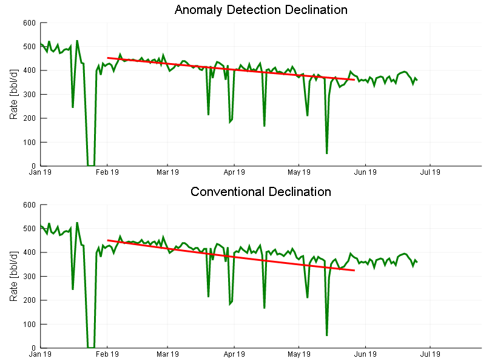

<br>

# WellProductivity

## Introduction

This package is being designed among others to provide Petroleum Engineering tools in a modern programming language. This package is part of the project 7G which  proposes to make basic but powerful engineering software packages that cover the main topics of the Oil and Gas development phases which could be applied to any case study by suitable engineers.

There are five topics in which the project is going to be focused on:

<br>-Geoscience
<br>-Reservoir
<br>-Production (Current Package)
<br>-Economics
<br>-Integration

<br> The package will always be in permanent development and open to suggestions to enhance the program. As the code has been written so far by a code enthusiastic Petroleum Engineer I hope to learn as much as possible to get better and useful programs.

## WellProductivity.jl Description  
WellProductivity.jl is a package to perform well productivity analysis (Oil and Gas) such as Decline curve analysis,  
artificial lift system design and performance.

Given some time series data of well production you can estimate the decline rate as well as the forecast to either a given time or economic limit. The Recipe Function include an Anomaly Detection Algorithm to detect those points which are not representative for the Decline Analysis, such as production stops etc...

You can visualize inflow and outflow curves, operation points and some sensibilities that affect the performance of the curves.   

### Tutorial  

Load Packages required
```julia
using SQLite
using CSV
using Plots
using Dates
using Interact
using DataFrames
using RecipesBase
using Statistics
using Distributions
using WellProductivity
```  
Load a production database to the Workspace, in this case a SQLite Database is used.

```julia
db=SQLite.DB("ProdDataBase.db")
```

Query the desired data. By using SQL language for Database, liquid production and Oil production of a well is extracted and the last 10 rows are displayed.

```julia  
p=DataFrame(SQLite.Query(db,"SELECT date(Date) as Date, LiquidRate, OilRate
                    FROM production
                    WHERE WellId=7"))
p.Datee=Date.(p.Date, Dates.DateFormat("yyyy-mm-dd"))

first(p,10)
```
<br>

You can use the ```oilrate``` recipe to plot the production Oil production data and optionally the liquid.

```julia
l=[Date(2019,1,1), Date(2019,5,27)]

p1=oilrate(p.Datee, p.OilRate, Dlim=l, legend=true, ylimit=(0,1800))
p2=oilrate(p.Datee, p.OilRate,p.LiquidRate, Dlim=l, mrange=2, Liquid=true,legend=true, ylimit=(0,3500))
plot(p1,p2, layout=(2,1))
```
<br>

You can perform a decline analysis in the same recipe by adding the required keywords.  
In the example is plotted the same data comparing the the Anomaly Detection algorthm feature in which filters the data that is most likely not to be representative.  

```julia
l=[Date(2019,1,1), Date(2019,5,27)]
r=[Date(2019,2,1), Date(2019,5,27)]
p1=oilrate(p.Datee, p.OilRate, Dlim=l,  ylim=(0,600),mrange=1, Dec=true, Drange=r, Ad=true)
p2=oilrate(p.Datee, p.OilRate, Dlim=l,  ylim=(0,600),  mrange=1, Dec=true, Drange=r, Ad=false )
plot(p1,p2, layout=(2,1), size=(800,600), title=["Anomaly Detection Declination" "Conventional Declination"])
```
<br>

You can add a forecast by setting ```forecast=true``` for a given months.

```julia
l=[Date(2019,1,1), Date(2019,12,31)]
r=[Date(2019,2,1), Date(2019,5,27)]
p1=oilrate(p.Datee, p.OilRate, Dlim=l, ylim=(0,600), mrange=2, Dec=true, Drange=r,Forecast=true, Ad=true, Mforecast=5, legend=true)
p2=oilrate(p.Datee, p.OilRate, Dlim=l, ylim=(0,600), mrange=2, Dec=true, Drange=r,Forecast=true, Ad=false, legend=true,Mforecast=5)
plot(p1,p2, layout=(2,1), size=(800,600), title=["Forecast Anomaly Detection Declination" "Forecast Conventional Declination"])
```
<br>

You can also stop the forecast by the Economic Limit

```julia
l=[Date(2019,1,1), Date(2019,12,31)]
r=[Date(2019,2,1), Date(2019,5,27)]
p1=oilrate(p.Datee, p.OilRate, p.LiquidRate, Dlim=l, ylim=(0,600), mrange=3, Dec=true, Drange=r,Forecast=true, Ad=true, legend=true, EconLimit=80)
p2=oilrate(p.Datee, p.OilRate, p.LiquidRate, Dlim=l, ylim=(0,600), mrange=3, Dec=true, Drange=r,Forecast=true, Ad=true, legend=true, Mforecast=12)
plot(p1,p2, layout=(2,1), size=(800,600),title=["Economic Limit Forecast" "Fixed Time Forecast"])
```
<br>

## Well Productivity Analysis - Inflow & Outflow curves

Oil and gas wells productivity index and vertical flow performance curves can be calculated to establish operation points. sensibitities can be applied in order to visualize the impact on production under risk operations.

### IPR

Oil IPR can be plotted with the ```iproil``` recipe by giving Reservoir Pressure and PI. Optionally the bubble point can be set in order to apply the Vogel Correlation.

For Pwf>Pb
<br>

for Pwf<= Pb


<br>


```julia
l=@layout[a b ; c]
p1=iproil(1300,2.5,Pb=600, title="Vogel Correlation Pwf<Pb")
p2=iproil(1300,2.5, title="Linear Productivity Index")
p3=iproil([3400, 3600],[10, 15],Pb=1000, title="Sensibilities on Pressure and PI")
plot(p1,p2,p3, layout=l, size=(800,600), legendfontsize=6)
```
<br>

Gas IPR can be plotted with the ```iprgas``` recipe by giving Reservoir Pressure, Pi and a tabulated Gas PVT. The recipe does not approximate the solution according with the pressure regions, instead it calculates the Real-Gas Pseudopressure in the range of the iprgas

<br>

Where,  

<br>

```julia
GasPVT=CSV.read("GasPVT.csv")
first(GasPVT,10)
```
<br>


You also can apply some sensibilities to the reservoir pressure and Pi of the gas.
```julia
iprgas([1100,1200],[0.9e-4, 1.4e-4],GasPVT, legendfontsize=6)
```
<br>

### VFP

The Oil vertical Flow Performance curve is calculated through The Modified Hagedorn and Brown Method.

```julia
p1=vfpoil(5500,[50,70],0.5,OilPVT,GasPVT,WaterPVT, 1500, dis=2.99, title="Thp Sensibility")
p2=vfpoil(5500,50,[0.5,0.7],OilPVT,GasPVT,WaterPVT, 1500, dis=2.99,title="Bsw Sensibility")
p3=vfpoil(5500,50,0.7,OilPVT,GasPVT,WaterPVT, 1500, dis=[2.99,3.5],title="Tubing Diameter Sensibility")
p4=vfpoil(5500,50,0.7,OilPVT,GasPVT,WaterPVT, 1500, dis=2.99,GORs=[300,600],title="GOR sensibility")

plot(p1,p2,p3,p4, layout=4, legendfontsize=6, size=(800,600))
```

<br>

You could plot the IPR and VFP in a single plot

```julia
iproil([1000, 1200],[1.5,2],Pb=2100)
vfpoil!(5500,[50,70],0.5,OilPVT,GasPVT,WaterPVT, 1500, legend=false)
```
<br>

The Gas vertical flow  permformance is estimed trough the energy balance for compressible fluids.

```julia
p1=vfpgas(5500,collect(500:100:700),GasPVT, 12000, title="Thp Sensibility")
p2=vfpgas(5500,650,GasPVT, 12000, dis=[2.99,3.5], title="Pipe diameter Sensibility")
plot(p1,p2, layout=(1,2), size=(800,400))
```
<br>

You could plot the IPR and VFP in a single plot

```julia
iprgas([1100,1200],0.9e-4,GasPVT)
vfpgas!(5500,collect(500:50:700),GasPVT, 12000, legend=false)
```
<br>


### Operation Point Estimation

There are cases where you what to estimate de operation point at certain conditions. With the Recipes ```oilnodal``` and ```gasnodal``` you can estimate the operation point to a given Inflow and Outflow parameters.

```julia
p1=oilnodal(1800,2,5500,80,0.9,OilPVT,GasPVT,WaterPVT, Pbs=2100, ns=30 , title="Oil Well Operation Point")
p2=gasnodal(1200,0.9e-4, 5500,350,GasPVT, title="Gas Well Operation Point")
plot(p1,p2, layout=(1,2),size=(900,400))
```
<br>


## ALS analysis

### Electric Submersible Pump (ESP)

You can visualize ESP curve performance of any pump included in the database. You can easily use any pump by providing the next information in a DataFrame. The Head Performance and the Power are described by Polynomials coefficients at stage reference (Usually 1 Stage) and Frequency Reference (Usually 60 Hz). In the next file is the initial ESP catalogue which you can contribute by adding the pump parameters you have.
```julia
:Manufacter
:Series
:Model
:MinCsg
:RefFreq
:RefStg
:Min
:BEP
:Max
:AOF
:H0
:H1
:H2
:H3
:H4
:H5
:H6
:P0
:P1
:P2
:P3
:P4
:P5
:P6
```

The Head and Power Polynomials coefficients are evaluated through Polynomial.jl Package.

Example:

By default the ESP performance curve is evaluated at Reference Stange and Frecuency, usually 1 stage and 60 Hz.
```julia
espplott(ctg[6,:],1)
```
<br>

You can also specify the Stages number and the Frequency you want.

```julia
espplott(ctg[15,:],1,stg=59, fq=32)
```
<br>

Besides, you can also evaluate the pump according with any well productivity, by providing information of Inflow and Outflow.

Example:

Evaluate the ESP Macth in a well with the next parameters

Pump series 538 7000 bbl/d
Stages:  59
Reservoir Pressure: 3600 psi  
Productivity : 20 bbl/d-psi  
Given Oil-Water-Gas Black Oil GasPVT
Well Head Pressure: 200 psi  
Pump Depth : 4040 ft
Perforates Depth : 8365 ft
Liquid Rate: 6000 bbl/d
Pupm Frequency: 43 Hz
Bsw: 95%

```julia
espmatch(ctg[15,:], 3600, 20, OilPVT, GasPVT, WaterPVT, 200, 4039, 8365, 6000, 0.9590, stg=59, fq=43)
```
<br>
